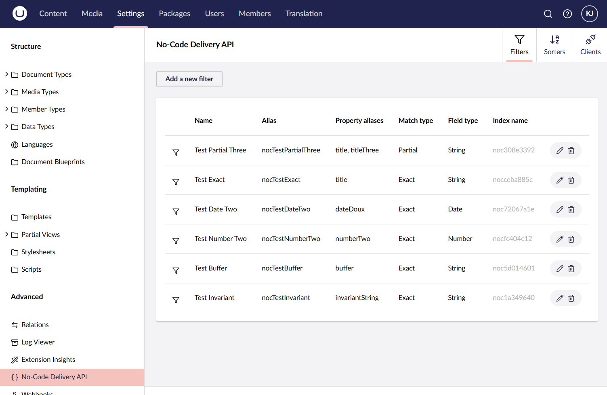

> [!NOTE]
> The main branch of this repo contains the source code for the Umbraco 15 version of the package. If you're looking for the source code for the Umbraco 13 version, go to the [V13 branch](https://github.com/kjac/NoCode.DeliveryApi/tree/v13). 

# No-Code Delivery API

The No-Code Delivery API package enables a no-code/configuration approach to the [Umbraco CMS](https://umbraco.com/) Delivery API, including:
- Custom filters and sorters for querying the Delivery API.
- CORS policies for clients consuming the Delivery API.
- Links to content preview (draft content) and published content directly from the Umbraco backoffice.

## Installing the package

> [!IMPORTANT]
> First and foremost, make sure the Delivery API is enabled. See the [Umbraco Delivery API docs](https://docs.umbraco.com/umbraco-cms/reference/content-delivery-api) for details.

The package is installed from [NuGet](https://www.nuget.org/packages/Kjac.NoCode.DeliveryApi):

```bash
dotnet add package Kjac.NoCode.DeliveryApi
```

Once installed you'll find a "No-Code Delivery API" entry in the "Advanced" part of the "Settings" section tree. Clicking this entry opens up the management UI, where you can configure querying and clients.



## Querying configuration

In the "Querying" section you can define custom filters and sorters for querying the Delivery API. Both are based on content property data

The created filters and sorters are automatically documented in the built-in Swagger UI (`/umbraco/swagger/`) for the Delivery API. Here you'll find samples on their usage as well as details on the applicable syntax for the different types of filters and sorters. The Swagger UI is also an excellent playground for testing your filters and sorters.


> [!IMPORTANT]
> When a filter or a sorter is created or updated, the changes will immediately take effect for newly created content. All existing content however must be re-published for the changes to take effect. Alternatively, the "DeliveryApiContentIndex" can be rebuilt from the [Examine Management dashboard](https://docs.umbraco.com/umbraco-cms/reference/searching/examine/examine-management).
> 
> This also applies to the built-in filters shipped with this package (read more below).

### Filters

A filter is defined by:

1. Its name. A filter name must be unique, because it is used to auto-generate the filter alias. You'll use the alias to execute the filter in your Delivery API queries.
2. One or more content property aliases. When a filter is executed, it is evaluated against the values of these content properties. Multiple aliases can be supplied, in case the filter values are partitioned across multiple properties. If a given content item contains multiple of these properties, the filter evaluates an OR match against them.
3. A field type (string, number or date). This both dictates how the filter understands your Delivery API queries, and how the subsequent evaluation is performed.
   - String field types allow for simple queries and different kinds of matching (see below).
   - Number and date field types allow for more complex queries like range filtering. They require that your Delivery API queries and the defined property values are numeric or dates, respectively.
4. A match type (string fields only), defining if the filter should perform an exact match or a partial match.
   - Use exact matching for identifier type fields, e.g. product SKUs or content pickers.
   - Use partial matching for textual (wildcard) searches.

### Sorters

A sorter is defined by:

1. Its name. A sorter name must be unique, because it is used to auto-generate the sorter alias. You'll use the alias to execute the sorter in your Delivery API queries.
2. A content property alias. The sorter uses the value of this property to sort the result of your Delivery API query.
3. A field type (string, number or date). This both dictates how the sorter understands your Delivery API queries, and how the subsequent sorting is performed.
   - String field types perform alphanumerical sorting.
   - Number field types perform numeric sorting. They require that your Delivery API queries and the defined property values are numerics. 
   - Date field types perform date/time sorting. They require that your Delivery API queries use the ISO 8601 format `yyyy-MM-ddTHH:mm:ss` (the time component is optional), and that the defined property values dates.

## Clients configuration

In the "Clients" section you can define your Delivery API consumers. This allows for automatic CORS policies as well as for outgoing links from the Umbraco backoffice (e.g. for previewing content).

A client is defined by:

1. Its name. Unlike filters and sorters, this is purely used for identification purposes in the Umbraco backoffice.
2. The origin (or domain) of the consumer. It must include the HTTP scheme, e.g. `https://mydomain.com` or `http://localhost:3000`. CORS policies will be applied to this origin, ensuring that your consumer is able to query the Delivery API from CORS restricted environments (e.g. a web browser).
3. A optional path to trigger preview. If the client supports content preview to be triggered via an URL, enter the relative path to this URL here. The path will be appended to the origin. To provide context for the preview, various placeholders can be used in the preview path (see below).
   The resulting preview links will be shown in the "Save and preview" button pop-up menu in the Umbraco content editor.
4. A optional path to view the published content. Similarly to the preview path, this will be appended to the origin, and placeholders can be applied here too.
   The resulting links will be shown in the "Info" section of the Umbraco content editor.
5. For multi-lingual setups, it is possible to define if the origin serves only one specific language or all languages. This is used in conjunction with the outgoing links, to ensure that only the language relevant links are shown in the Umbraco content editor at any given time.

You can use the following placeholders when defining the preview and published content links:

- `{id}` - the ID of the content.
- `{path}` - the content path.
- `{start-id}` - the ID of the content "start item".
- `{start-path}` - the path of the content "start item".
- `{culture}` - the culture (language) of the content.

For example, given the client origin `http://localhost:3000`:

- The path `/trigger-preview?id={id}&root={start-path}` would yield a resulting link like `http://localhost:3000/trigger-preview?id=fb3086d5-3a50-4d68-85dc-32c6c786df37&root=home`.
- The path `/{culture}/{path}` would yield a resulting link like `http://localhost:3000/en-US/path/to/content`.

All of these placeholder values should be directly identifiable in the Delivery API output for any given content item.

> [!TIP]
> Refer to the "Concepts" section of the [Umbraco Delivery API docs](https://docs.umbraco.com/umbraco-cms/reference/content-delivery-api#concepts) for more information on both the placeholder values and how to handle preview.

#### ⚠️ Known issues with clients in Umbraco 15

At this time, Umbraco 15 does not yet offer the same support for custom/additional URLs as Umbraco 13 does.  

This means that neither preview nor publish paths behave as described (items 3 through 5 in the list above). In fact, they do not have any effect at this time.

The support is expected to be added within the scope of Umbraco 15, so the preview and publish paths have been retained as part of the package.

## Built-in filters

The package ships with a few useful filters. These are enabled by default and documented in the Swagger UI.

### Level filter

This filter allows for querying content items based on their level in the content tree. The filter supports all query operators including range filtering.

Usage examples:

- `?filter=nocLevel:2` - returns all level 2 content items.
- `?filter=nocLevel:2,3` - returns all content items on level 2 and 3.
- `?filter=nocLevel:!2,3` - returns all content items _except those_ on level 2 and 3.
- `?filter=nocLevel>2` - returns all content items on levels _greater than_ level 2.

### IsNot filter

This filter lets you omit a specific content item from the query result. The filter supports only the equality operator.

Usage examples:

- `?filter=nocIsNot:cb738769-82fd-4b0d-9b51-d1626cc7b0bc` - omits the content item with ID "cb738769-82fd-4b0d-9b51-d1626cc7b0bc" from the result.

## Deployment

The package maintains a few configuration files with all filters and sorters in the folder `/NoCode/DeliveryApi/`. When Umbraco starts up, these files are read and any changes are synchronized to the Umbraco database.

If you have multiple Umbraco environments, you can deploy filters and sorters automatically between environments by including these files in your Umbraco deployment.

> [!NOTE]
> In load-balanced setups, these files are only ever handled by the "Publisher" instance.

> [!IMPORTANT]
> Clients are omitted from the deployment because they are expected to vary between environments. In other words, any changes to clients must be deployed manually.
